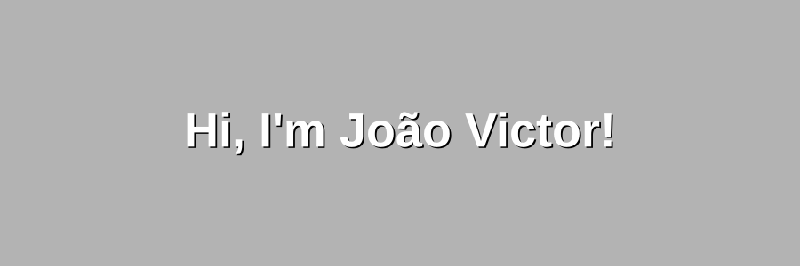

  <!-- Aqui chamamos o arquivo SVG que você acabou de criar -->
  

  

  

  

###  About Me:

I am a Front-end Developer specialized in crafting scalable and interactive interfaces using **React, TypeScript, and Tailwind CSS**. Beyond the interface, I care deeply about software architecture—I consistently apply **Clean Code** principles and structure my work using **Domain-Driven Design (DDD)**.

Currently, I'm expanding my skill set into backend technologies like Node.js and exploring 3D web experiences with Three.js. I thrive in challenging environments and am always looking for the next problem to solve.

 .&nbsp;Currently focusing on: **Full-stack Development (Node.js & FastAPI)**  
 .&nbsp;Open to collaborate on: **Open-source Front-end projects**  
 .&nbsp;Ask me about: **UI/UX integration and React architecture**  
 .&nbsp;Pronouns: **he/him**  
 .&nbsp;Fun fact: **I always have a full cup of coffee when I'm about to create React states.**

###  Tech Stack:

**Front-end & UI**  

  
  
  
  
  
  

**Back-end, Tools & Testing**  

  
  
  
  
  
  
  
  

---

###  GitHub Stats & Activity:

  
  

  

  

---

###  Connect With Me:

  
  
  

  

