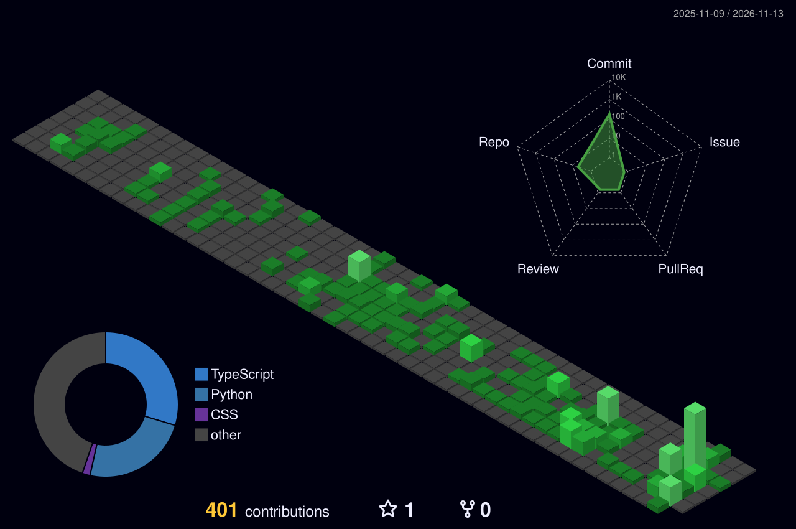

<!-- 1. BOOT SEQUENCE: TERMINAL -->

  

 

<!-- 2. COMMAND CENTER: SAVE ROOM VITALS -->

  

  <em>"What're ya buyin', stranger?"</em>

  

 

<!-- 3. EQUIPMENT: TECHNICAL ARSENAL -->

  <h3><b>[ TECHNICAL ARSENAL ]</b></h3>
  
  
<b>[  FRONT-END / UI ]</b>

  
    

  
<b>[  BACK-END / DATABASE ]</b>

  
    

  
<b>[  TOOLS, OS & INFRASTRUCTURE ]</b>

  

 
 

<!-- 4. ATMOSPHERE & LORE: AUDIO LOG & MISSION LOG -->

  <!-- Spotify File -->
  

    
<b>[  PLAY CASSETTE TAPE: SAFE_ROOM_THEME ]</b>

     
    
  

   
  
  <!-- Bio File -->
  

    
<b>[  READ CONFIDENTIAL FILE: MISSION_LOG.TXT ]</b>

     
    
<i>"Structural transition ongoing. Systems stabilized."</i>

    
Currently stationed as a Front-End Developer at <b>Futuro Construções</b>. Focused on building immersive interfaces (React, Tailwind), while exploring container orchestration (Docker) and Full Stack architectures.

  

 

  <picture>
    
  </picture>

 

<!-- 6. RAW DATA: METRICS TERMINAL -->

  

    
<b>[  ACCESS DATA TERMINAL: GITHUB_METRICS ]</b>

     
    
  

  <h3><b>[ COMMUNICATIONS RELAY ]</b></h3>
   
  
  

 

  
<i>[ END OF TRANSMISSION ]</i>

